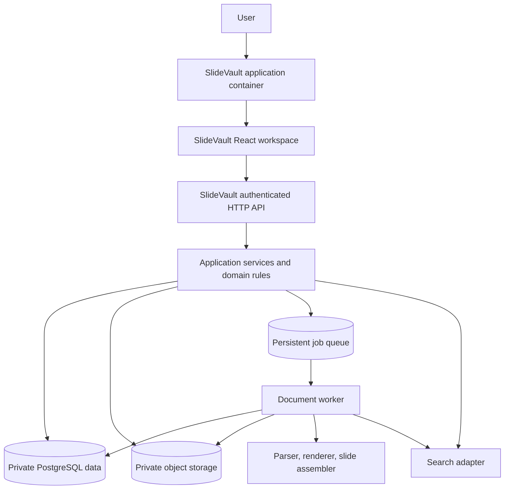

# SlideVault architecture

Status: proposed implementation baseline for SlideVault. The technical choices below are recommendations, not recorded owner-approved decisions. Resolve material changes through [DECISIONS.md](DECISIONS.md).

## Scope and architecture intent

The provisional first delivery is a slide library with ingestion, browsing/search, slide selection, and PowerPoint export. Storyboard creation is a second phase. Broader RFP and proposal-generation workflows belong to later scope unless the owner explicitly moves them forward. The supplied HTML and presentation are product references, not executable architecture specifications or final acceptance criteria.

Build a standalone application with a reusable React workspace and clear boundaries between UI, domain logic, infrastructure, and document processing. SlideVault may someday be embedded in an internal application; this scope does not specify a destination architecture or deployment. Portability is therefore a project quality requirement, demonstrated through a generic test container.

The recommended shape is a **modular monolith for the web application, with a separate worker process for heavy document work**. This keeps one application model and one set of contracts while separating work that has different runtime, resource, and failure characteristics.

## Proposed technology choices

These choices are proposed for SlideVault itself. Confirm exact versions during scaffolding, record them in the repository, and use a lockfile. This documentation does not install packages or claim compatibility with another application.

| Area | Proposed choice | Purpose |
| --- | --- | --- |
| Runtime | Node.js 22 or newer supported LTS release | A documented runtime shared by the web application and compatible worker code. |
| Web framework | Next.js 16, App Router | Standalone application pages and thin HTTP route handlers. |
| UI | React 19 | An importable workspace that renders within a parent container. |
| Language | TypeScript 5 with strict checking | Typed application code and shared contracts. |
| Styling | CSS design tokens, with Tailwind CSS if selected | Consistent styling with isolated component scope and configurable theme values. |
| Data | PostgreSQL; query and migration tooling selected at Gate 1 | Feature-owned schema with replaceable persistence, authentication, and object-storage adapters. |
| Testing | TypeScript checks, ESLint, domain/API/worker/browser tests | Verification of behavior, processing fidelity, and portability. |

Review major-version changes or an additional framework through the decision log. Select conversion, rendering, and slide-assembly libraries through the fidelity spike described in the delivery plan, using the agreed fixture corpus and licensing requirements.

## System boundaries



The diagram shows logical boundaries, not a requirement to buy or deploy a separate product for every box. For example, job records and initial search can live in PostgreSQL if the implementation meets the agreed requirements. Search-provider and queue-provider choices remain replaceable infrastructure decisions.

| Boundary | Owns | Must not own |
| --- | --- | --- |
| Application container | Application layout, identity setup, environment composition, route mounting | Slide domain rules or dependencies on a particular embedding environment |
| React workspace | Library UI, upload/export progress, local interaction state, capability-aware controls | Login lifecycle, global navigation, server credentials, direct database access |
| API composition | Request validation, verified identity, authorization, rate/size limits, service invocation, HTTP responses | Heavy document conversion inside a request |
| Application/domain | Source and slide lifecycle, metadata rules, selections, export manifests, job orchestration | Next.js request objects, UI state, provider SDK types in public contracts |
| Infrastructure adapters | Database queries, object-storage access, queue/search/provider integration | Independent authorization policy that disagrees with application services |
| Worker | Bounded document processing, rendition generation, indexing, export assembly, progress reporting | Public browser endpoints or unrelated application responsibilities |

## Suggested repository layout

This is a proposed destination structure, not a statement that these files already exist. Use one ordinary Next.js application initially; a package monorepo is optional only if a demonstrated need justifies it.

```text
app/
  layout.tsx                          # Standalone application container
  slide-vault/                        # Thin pages and route mounting
  api/slide-vault/                     # Thin authenticated HTTP handlers
features/slide-vault/
  index.ts                            # Intentional browser-safe public entry point
  components/                         # Workspace and feature UI
  client/                             # Transport adapter, client queries, UI state
  contracts/                          # Validated DTOs and shared contract types
  domain/                             # Pure rules and state transitions
  server/
    services/                         # Use cases and authorization orchestration
    ports/                            # Required infrastructure interfaces
    adapters/                         # Development/production implementations
workers/slide-vault/
  processors/                         # Ingest, render, index, export
  runner/                             # Job claiming, progress, retry, shutdown
db/migrations/                        # SlideVault-owned schema changes
tests/fixtures/                       # Synthetic examples with provenance
tests/                                # Cross-boundary and browser tests
docs/                                 # Handoff, contracts, runbooks, decisions
```

An equivalent migration directory required by the chosen database tooling is acceptable. Keep one authoritative migration history. Worker code can share domain and contract modules, but must not import React components or the web framework to perform its core work. Separate server-only entry points from browser exports so a UI import cannot bundle credentials or privileged SDKs.

## Portable workspace and runtime adapters

Expose one workspace entry point that can render inside a parent container. Provide explicit inputs or adapters for capabilities, authenticated transport, navigation/base paths, and optional container interactions. The exact interface belongs in [INTEGRATION_CONTRACT.md](INTEGRATION_CONTRACT.md).

The workspace must not initialize a global auth client, replace the document body, install a second application router, mutate the enclosing application's theme, or assume it owns the viewport. It can own its internal tabs, panels, and detail navigation through the agreed navigation adapter. The standalone application container provides login, top-level navigation, theme selection, and page layout.

Use relative feature navigation and configurable API/asset locations. Preserve deep-link and browser-history behavior at the agreed route base. Keep browser storage keys feature-scoped; do not depend on persistent local browser state as the authoritative source for saved selections or jobs.

On the server, an authentication adapter supplies verified identity and an authorization adapter resolves permitted actions and resource scope. A browser-provided user ID or capability list is never a trusted server identity. Every read, mutation, job-status lookup, preview, and export-download request must enforce the applicable server policy. Exact role names and scope rules are pending product decisions; the feature should consume explicit permissions rather than infer authority from a display role.

Demonstrate native React mounting through a generic test container. Keep the worker independently deployable, with an explicit interface and data boundary. These requirements preserve deployment options without selecting a future embedding destination.

## Data and document lifecycle

Treat original source decks as immutable inputs. Store durable source IDs, source versions, slide IDs, and derivation/version metadata. Thumbnails, extracted text, search records, and exported decks are derived artifacts and can be rebuilt. Keep private object keys as durable references; generate authorized temporary access when needed rather than storing expiring URLs as record identity.

Use the processing lifecycle `queued`, `validating`, `processing`, `ready`, `failed` and `cancelled`, with explicit transition rules. Upload-session and human-review states remain separate. The state model is defined in [DATA_AND_API.md](DATA_AND_API.md). A failed render must not make a slide appear ready for export when its required source data is unavailable.

The upload path should validate the declared file, create an authorized upload operation, transfer bytes to private storage, verify completion, and enqueue processing. A direct signed upload can avoid routing large document bodies through the web application. The server must verify the resulting object and associate it with the authorized upload before processing; possession of an upload URL is not permission to publish arbitrary library content.

Persist an export manifest before work begins. It identifies the exact source versions, selected slides, order, and export options. Assemble from the appropriate original presentation content. Thumbnail images are browsing assets and are not an acceptable substitute for editable slides when editable PowerPoint output is required. Fidelity requirements—including fonts, themes, masters, layouts, embedded media, charts, notes, and unsupported content—must be demonstrated on an agreed fixture corpus, with limitations documented rather than silently flattened.

Keep feature data in dedicated tables or a dedicated schema with a consistent naming convention. Use verified identity subjects for ownership and access. If a confirmed requirement needs an external project or directory association, use an opaque reference and an explicit lookup adapter instead of building another directory. The initial library visibility model must be agreed before finalizing access policies.

## Worker and job execution

Parsing, conversion/rendering, bulk indexing, and PowerPoint assembly run outside interactive request lifetimes. The web API returns a durable job reference; the UI obtains progress through the agreed polling or event mechanism. Do not rely on an in-memory promise, a browser tab remaining open, or a web process surviving after its response.

The implementation must provide:

- Persisted job input and state, a claim/lease mechanism, bounded concurrency, and recovery after a worker crash.
- Idempotent processing or deduplication keyed to the operation and source version; retries must not create duplicate published slides or exports.
- Bounded time, memory, temporary-disk use, parser output, and file/decompression size.
- Classified failures, capped retry/backoff for transient failures, and a clear terminal result for unsupported or corrupt files.
- Authorized status and result retrieval, with artifact retention and cleanup aligned to the data policy.
- Versioned worker inputs/results and processing versions so reprocessing and deployment changes are auditable.

Run parsers and office-conversion tools in an isolated environment with restricted filesystem access and unnecessary network access disabled. If a processor needs a native binary, system fonts, or a specific operating system, include that runtime in the worker deployment definition. Record those dependencies and licenses. A web hosting platform’s request runtime must not be assumed to supply them.

## Development, deployment, and transfer

Develop with dedicated infrastructure, synthetic fixtures, and project-specific credentials. All provider configuration comes through documented environment variables or server composition. The complete standalone application must be reproducible from this repository and its setup instructions.

Before delivery, demonstrate a clean checkout, database bootstrap, fixture import, app build, worker startup, and one complete ingest-to-export journey. Document provider resources, migration order, indexing/reprocessing commands, storage layout, worker scaling, failure recovery, and backup/restore expectations in [SECURITY_AND_OPERATIONS.md](SECURITY_AND_OPERATIONS.md).

The delivery package must cover the following boundaries:

| Deliverable | Required evidence |
| --- | --- |
| Workspace, domain/services, API contracts, worker, migrations, and tests | Clean build and complete standalone user journeys |
| Authentication, authorization, transport, and storage adapters | Documented contracts and replacement in a generic test container |
| Data export/import tooling and reconciliation instructions | Approved fixture transfer with stable references and verified object hashes |
| Dependency inventory, processing limitations, operations runbook | Reproducible deployment, recovery, and documented configuration |

Deliver source and configuration for the web application, reusable workspace, application services, and separately deployable worker. Select the standalone production topology through the decision log. Any future embedding project will define its own destination adapters, data mapping, and rollout procedure.

A portability demonstration must mount the workspace inside a generic test container, change its route base, replace transport/identity adapters, and exercise ingestion, denied access, search, selection, and export. The test container is an independent fixture, not a model of another application. It must use the workspace without importing the standalone login or page layout.

## Decisions to settle before implementation commitments

Track the decision, owner, date, alternatives, and consequence in [DECISIONS.md](DECISIONS.md):

- Confirm first-release scope and whether storyboards remain phase two.
- Confirm library visibility, ownership, publishing rules, and permitted actions.
- Choose and validate the PowerPoint parser, renderer, and assembly approach against acceptance fixtures.
- Agree supported file constructs, maximum sizes, throughput, fidelity, and response-time targets.
- Select worker, database, storage, search, and job infrastructure with cost and portability evidence.
- Agree retention, deletion, data residency, and any permitted AI processing.
- Confirm standalone deployment topology and responsibility for migration and ongoing operations.

Use [DELIVERY_PLAN.md](DELIVERY_PLAN.md) to turn these into staged acceptance gates. Acceptance covers ingestion fidelity, authorization, recovery, and the documented portability demonstration as well as the user interface.
